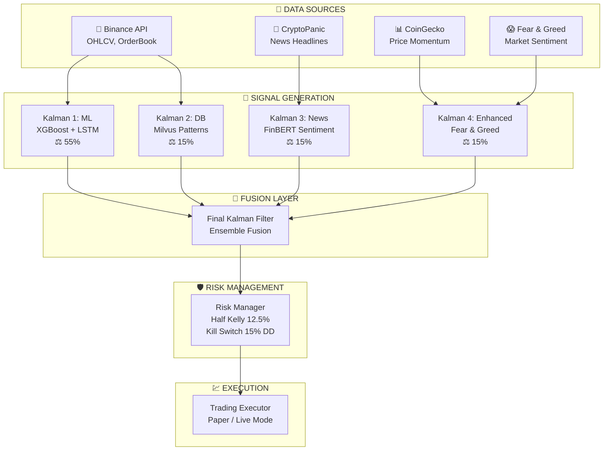
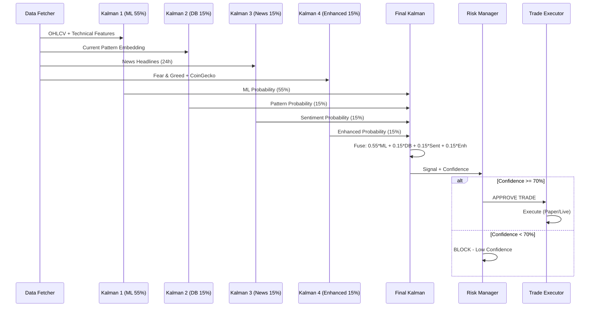

<div align="center">

# SURGE-AI Trading

### Sistem Trading Algoritmik dengan AI & Kalman Filters
### Algorithmic Trading System with AI & Kalman Filters

_"Trading cerdas, keputusan berbasis data"_ | _"Intelligent trading, data-driven decisions"_

[](https://suriota.com)
[]()
[]()
[]()

</div>

---

## Daftar Isi / Table of Contents

- [Gambaran Umum](#gambaran-umum--overview)
- [Fakta Singkat](#fakta-singkat--quick-facts)
- [Arsitektur Sistem](#arsitektur-sistem--system-architecture)
- [Alur Signal Generation](#alur-signal-generation--signal-generation-flow)
- [Hasil Performa](#hasil-performa--performance-results)
- [Teknologi](#teknologi--technology-stack)
- [Persyaratan Jaringan](#persyaratan-jaringan--network-requirements)
- [Quick Start](#quick-start-commands)
- [Dokumentasi](#indeks-dokumentasi--documentation-index)

---

## Gambaran Umum / Overview

**🇮🇩 Indonesia:**

**SURGE-AI Trading** adalah sistem trading algoritmik internal SURIOTA yang menggunakan kombinasi Machine Learning, Kalman Filters, dan Sentiment Analysis untuk menghasilkan sinyal trading cryptocurrency secara otomatis.

Sistem ini menggabungkan 4 sumber sinyal yang difusikan menggunakan Kalman Filter adaptif untuk menghasilkan keputusan trading yang optimal dengan manajemen risiko terintegrasi.

**🇬🇧 English:**

**SURGE-AI Trading** is SURIOTA's internal algorithmic trading system that combines Machine Learning, Kalman Filters, and Sentiment Analysis to generate automated cryptocurrency trading signals.

The system fuses 4 signal sources using adaptive Kalman Filters to produce optimal trading decisions with integrated risk management.

### Mengapa "SURGE-AI Trading"? / Why "SURGE-AI Trading"?

| Komponen / Component | Makna / Meaning |
|----------------------|-----------------|
| **SURGE** | Suriota Governance Ecosystem - Platform induk / Parent platform |
| **AI** | Artificial Intelligence - ML + LLM components |
| **Trading** | Automated cryptocurrency trading |

---

## Fakta Singkat / Quick Facts

| Aspek / Aspect | Detail |
|----------------|--------|
| **Tipe Produk / Product Type** | Internal Tool (Tidak dijual / Not for sale) |
| **Tujuan / Purpose** | Generate trading profits secara otomatis |
| **Target Asset** | Cryptocurrency (Binance only) |
| **Modal Awal / Initial Capital** | < $10,000 (Testing/Conservative) |
| **Tech Stack** | Python + FastAPI + TimescaleDB + Milvus + Redis |
| **ML Models** | XGBoost (55%) + LSTM (integrasi) |
| **Kalman Filters** | 4 filters dengan bobot adaptif |
| **Exchange** | Binance (Spot) |
| **Biaya Operasional / Operating Cost** | ~$50-65/bulan |

### Bobot Kalman Filter / Kalman Filter Weights

| Filter | Bobot / Weight | Teknologi / Technology |
|--------|:--------------:|------------------------|
| **Kalman 1 (ML)** | 55% | XGBoost + LSTM |
| **Kalman 2 (DB)** | 15% | Milvus Vector Pattern |
| **Kalman 3 (Sentiment)** | 15% | FinBERT News Analysis |
| **Kalman 4 (Enhanced)** | 15% | Fear & Greed + CoinGecko |

---

## Arsitektur Sistem / System Architecture



### Penjelasan Layer / Layer Description

**🇮🇩 Indonesia:**

1. **Data Sources** - Mengumpulkan data dari Binance (OHLCV), CryptoPanic (berita), CoinGecko (momentum), dan Fear & Greed Index
2. **Signal Generation** - 4 Kalman Filter memproses data secara paralel dengan bobot berbeda
3. **Fusion Layer** - Menggabungkan semua sinyal dengan Final Kalman Filter
4. **Risk Management** - Menerapkan position sizing (Half Kelly 12.5%) dan kill switch (15% drawdown)
5. **Execution** - Eksekusi trading di Paper mode (simulasi) atau Live mode (real money)

**🇬🇧 English:**

1. **Data Sources** - Collects data from Binance (OHLCV), CryptoPanic (news), CoinGecko (momentum), and Fear & Greed Index
2. **Signal Generation** - 4 Kalman Filters process data in parallel with different weights
3. **Fusion Layer** - Combines all signals using Final Kalman Filter
4. **Risk Management** - Applies position sizing (Half Kelly 12.5%) and kill switch (15% drawdown)
5. **Execution** - Executes trades in Paper mode (simulation) or Live mode (real money)

---

## Alur Signal Generation / Signal Generation Flow



### Formula Sinyal / Signal Formula

```
Final Signal = 0.55 × Kalman_ML + 0.15 × Kalman_DB + 0.15 × Kalman_Sentiment + 0.15 × Kalman_Enhanced
```

| Hasil / Result | Kondisi / Condition |
|----------------|---------------------|
| **LONG** | Final Probability >= 0.55 (threshold) |
| **SHORT** | Final Probability <= 0.45 (1 - threshold) |
| **HOLD** | Otherwise (low confidence) |

---

## Hasil Performa / Performance Results

### Backtest Results (Feb - Dec 2025)

**🇮🇩 Indonesia:**

Hasil backtest menggunakan data historis 7,969 candle per jam dengan konfigurasi optimasi terbaru.

**🇬🇧 English:**

Backtest results using 7,969 hourly candles with the latest optimization configuration.

| Symbol | Return | Trades | Win Rate | Max DD | Sharpe Ratio | Profit Factor |
|--------|:------:|:------:|:--------:|:------:|:------------:|:-------------:|
| **BTCUSDT** | -3.01% | 165 | 50.9% | 7.23% | -5.56 | 0.84 |
| **ETHUSDT** | **+2.48%** | 68 | 47.1% | 3.54% | **5.93** | **1.20** |

### Konfigurasi Backtest / Backtest Configuration

| Parameter | Value |
|-----------|:-----:|
| Position Size | 12.5% (Half Kelly) |
| Commission | 0.1% |
| Stop Loss | 2% |
| Take Profit | 3% |
| Risk:Reward | 1:1.5 |
| Threshold | 0.55 |

### Key Insight

**🇮🇩:** ETHUSDT menunjukkan performa positif dengan Sharpe Ratio 5.93, menandakan return yang baik relatif terhadap risiko.

**🇬🇧:** ETHUSDT shows positive performance with 5.93 Sharpe Ratio, indicating good risk-adjusted returns.

---

## Teknologi / Technology Stack

### Core Technologies

| Kategori / Category | Teknologi / Technology | Fungsi / Function |
|---------------------|------------------------|-------------------|
| **Language** | Python 3.11+ | Ekosistem ML / ML ecosystem |
| **Web Framework** | FastAPI | Async API endpoints |
| **Time-Series DB** | TimescaleDB | OHLCV + Indicators storage |
| **Vector DB** | Milvus | Pattern matching embeddings |
| **Cache** | Redis | Real-time data buffer |

### Machine Learning

| Kategori / Category | Teknologi / Technology | Fungsi / Function |
|---------------------|------------------------|-------------------|
| **ML Framework** | XGBoost | Gradient boosting classifier |
| **Deep Learning** | PyTorch (LSTM) | Price sequence prediction |
| **NLP/LLM** | FinBERT | Financial sentiment analysis |
| **Kalman Filter** | filterpy | Signal fusion |

### External APIs

| API | Fungsi / Purpose | Biaya / Cost |
|-----|------------------|--------------|
| **Binance** | Market data + Trading | Free |
| **CryptoPanic** | News headlines | Free tier |
| **CoinGecko** | Price momentum | Free tier |
| **Alternative.me** | Fear & Greed Index | Free |

---

## Persyaratan Jaringan / Network Requirements

### VPN untuk Indonesia / VPN for Indonesia

**🇮🇩 Indonesia:**

Binance diblokir oleh KOMINFO di Indonesia. Untuk mengakses Binance API, diperlukan VPN.

**🇬🇧 English:**

Binance is blocked by KOMINFO in Indonesia. A VPN is required to access Binance API.

### Solusi Rekomendasi / Recommended Solution

**Cloudflare WARP** (Gratis / Free, CLI Support)

```bash
# Install di Windows
winget install Cloudflare.Warp

# Aktivasi
warp-cli registration new
warp-cli connect

# Cek status
warp-cli status

# Disconnect
warp-cli disconnect
```

> 📖 Panduan lengkap: [operations/VPN_SETUP.md](./operations/VPN_SETUP.md)

---

## Web Dashboard

### Dashboard Overview

**SURGE-AI Trading Dashboard** adalah antarmuka web untuk monitoring dan trading semi-otomatis.

**SURGE-AI Trading Dashboard** is a web interface for monitoring and semi-autonomous trading.

```
┌──────────────────────────────────────────────────────────────────────┐
│  SURGE-AI Trading                    [🟢 Connected] [IDR/USD] [⚙️]  │
├──────────────────────────────────────────────────────────────────────┤
│  ┌─────────┐  ┌─────────┐  ┌─────────┐  ┌─────────┐                 │
│  │ BTC/USD │  │Portfolio│  │Daily P&L│  │Win Rate │                 │
│  │$87,648  │  │$9,234   │  │+$112.34 │  │72.7%    │                 │
│  └─────────┘  └─────────┘  └─────────┘  └─────────┘                 │
│                                                                      │
│  ┌─────────────────┐  ┌────────────────┐  ┌──────────────────────┐  │
│  │ 🎯 SIGNAL PANEL │  │ 📈 PERF CHART  │  │ 📋 ACTIVITY FEED     │  │
│  │ LONG 72.3%     │  │ Equity Curve   │  │ • LONG Signal 72.3%  │  │
│  │ Kalman: ML/DB  │  │ 30-day chart   │  │ • Trade Closed +2.9% │  │
│  │                 │  │                │  │ • Signal Blocked     │  │
│  │ ┌─────────────┐ │  ├────────────────┤  └──────────────────────┘  │
│  │ │ TRADE REC.  │ │  │ 🛡️ RISK DASH  │                            │
│  │ │ BUY 0.014BTC│ │  │ DD: 2.3%/15%  │                            │
│  │ │ $1,244 IDR  │ │  │ Kill: OFF     │                            │
│  │ │[EXECUTE]    │ │  └────────────────┘                            │
│  │ └─────────────┘ │                                                │
│  └─────────────────┘                                                │
└──────────────────────────────────────────────────────────────────────┘
```

### Dashboard Features

| Feature | Description |
|---------|-------------|
| **Live Price Ticker** | Real-time price with IDR conversion |
| **Signal Panel** | Current signal with Kalman breakdown |
| **Trade Recommendation** | Kapan buy/sell, berapa quantity |
| **1-Click Execute** | Semi-autonomous trading |
| **Risk Dashboard** | Drawdown, exposure, kill switch |
| **Activity Feed** | AI decisions & reasoning |
| **Performance Chart** | 30-day equity curve |

### Dashboard Quick Start

```bash
# Windows
cd scripts
start.bat

# Linux/Mac
cd scripts
chmod +x start.sh
./start.sh
```

**URLs:**
- Dashboard: http://localhost:3000
- API Docs: http://localhost:8000/docs
- WebSocket: ws://localhost:8000/ws

### Tech Stack (Dashboard)

| Layer | Technology |
|-------|------------|
| **Frontend** | Next.js 14 + React + TypeScript |
| **UI** | Tailwind CSS + Shadcn UI |
| **State** | Zustand |
| **Charts** | Recharts |
| **Backend** | FastAPI (Python) |
| **Real-time** | WebSocket |

---

## Quick Start Commands

### 1. Setup VPN (Indonesia Only)

```bash
# Install Cloudflare WARP
winget install Cloudflare.Warp

# Connect
warp-cli connect
```

### 2. Install Dependencies

```bash
cd ml
pip install -r requirements.txt
```

### 3. Generate Signal

```bash
# Full Kalman fusion signal
python kalman_fusion.py --symbol BTCUSDT

# With higher confidence threshold
python kalman_fusion.py --symbol BTCUSDT --threshold 0.55
```

### 4. Paper Trading (Simulasi)

```bash
# Single execution
python trading_executor.py --symbol BTCUSDT --mode paper

# Continuous trading (setiap 60 detik)
python trading_executor.py --symbol BTCUSDT --mode paper --continuous --interval 60
```

### 5. Backtest

```bash
# Run backtest
python backtest.py --symbol BTCUSDT --threshold 0.55

# Custom date range
python backtest.py --symbol BTCUSDT --start 2025-06-01 --end 2025-12-31
```

### 6. Live Trading (Hati-hati! / Careful!)

```bash
# Testnet dulu (SELALU testnet dulu!)
python trading_executor.py --symbol BTCUSDT --mode live --testnet

# Production (REAL MONEY - requires confirmation)
python trading_executor.py --symbol BTCUSDT --mode live --production
```

> 📖 Panduan lengkap: [QUICK_START.md](./QUICK_START.md)

---

## Biaya Infrastruktur / Infrastructure Cost

| Komponen / Component | Biaya Bulanan / Monthly Cost |
|----------------------|-----------------------------|
| VPS Server (4 vCPU, 8GB RAM) | $48-60 |
| APIs (Free tiers) | $0 |
| VPN (Cloudflare WARP) | $0 |
| Domain + SSL (Cloudflare) | $0 |
| **Total** | **~$50-65/bulan** |

---

## Indeks Dokumentasi / Documentation Index

### Quick Start & Guides

| Dokumen / Document | Deskripsi / Description |
|--------------------|-------------------------|
| [QUICK_START.md](./QUICK_START.md) | Panduan mulai cepat / Quick start guide |
| [BUSINESS_ANALYSIS.md](./BUSINESS_ANALYSIS.md) | Analisis bisnis lengkap / Complete business analysis |

### Technical Documentation

| Dokumen / Document | Deskripsi / Description |
|--------------------|-------------------------|
| [technical/ARCHITECTURE.md](./technical/ARCHITECTURE.md) | Arsitektur sistem / System architecture |
| [technical/SIGNAL_FLOW.md](./technical/SIGNAL_FLOW.md) | Alur signal generation / Signal generation flow |
| [technical/TRADING_FLOW.md](./technical/TRADING_FLOW.md) | Alur eksekusi trading / Trading execution flow |
| [technical/DATABASE_SCHEMA.md](./technical/DATABASE_SCHEMA.md) | Skema database / Database schemas |
| [technical/API_SPECIFICATION.md](./technical/API_SPECIFICATION.md) | Spesifikasi API internal / Internal API specs |
| [technical/DEPLOYMENT_GUIDE.md](./technical/DEPLOYMENT_GUIDE.md) | Panduan deployment / Deployment guide |

### Operations

| Dokumen / Document | Deskripsi / Description |
|--------------------|-------------------------|
| [operations/RUNBOOK.md](./operations/RUNBOOK.md) | Panduan operasional harian / Daily operations guide |
| [operations/RISK_MANAGEMENT.md](./operations/RISK_MANAGEMENT.md) | Aturan risiko & kill switch / Risk rules & kill switch |
| [operations/PROFIT_MODEL.md](./operations/PROFIT_MODEL.md) | Model profit & analisis / Profit model & analysis |
| [operations/VPN_SETUP.md](./operations/VPN_SETUP.md) | Setup VPN untuk Indonesia / VPN setup for Indonesia |

### ML Module

| Dokumen / Document | Deskripsi / Description |
|--------------------|-------------------------|
| [ml/README.md](./ml/README.md) | Dokumentasi modul ML / ML module documentation |

### References

| Dokumen / Document | Deskripsi / Description |
|--------------------|-------------------------|
| [references/RESEARCH_REFERENCES.md](./references/RESEARCH_REFERENCES.md) | Referensi penelitian / Research sources |

---

## Risk Management Rules

| Aturan / Rule | Nilai / Value | Deskripsi / Description |
|---------------|:-------------:|-------------------------|
| **Max Position Size** | 12.5% | Half Kelly Criterion |
| **Max Total Exposure** | 50% | Maksimum modal terpakai |
| **Max Drawdown** | 15% | Kill switch trigger |
| **Daily Loss Limit** | 3% | Stop trading hari ini |
| **Min Confidence** | 70% | Minimum untuk trading |
| **Stop Loss** | 2% | Per-trade risk limit |
| **Take Profit** | 3% | Per-trade profit target |
| **Risk:Reward** | 1:1.5 | SL vs TP ratio |

---

## Original Concept / Konsep Asli

Designed by **Kemal** with the following architecture vision:

1. API Key Exchange (Now) - Binance
2. ML EA Python (MACD, RSI, EMA)
3. Database Learning 6 Year - Vector DB
4. Scraping News: Web/X/Bloomberg - Vector
5. Kalman Filter 1 (ML)
6. Kalman Filter 2 (DB)
7. Kalman Filter 3 (News)
8. Position Sizing / Capital Finance
9. Final Kalman Filter (Ensemble) with mini LLM

---

## Riwayat Versi / Version History

| Versi / Version | Tanggal / Date | Deskripsi / Description |
|-----------------|----------------|-------------------------|
| 2.0 | January 2026 | Production ready, 4 Kalman filters, comprehensive documentation |
| 1.0 | January 2026 | Initial documentation & architecture design |

---

## Kontak / Contact

**PT Surya Inovasi Prioritas (SURIOTA)**

- Email: sales@suriota.com
- Website: www.suriota.com
- Phone: +62 858-3567-2476

---

<div align="center">

**Internal Use Only** - Tidak untuk distribusi eksternal / Not for external distribution

</div>
